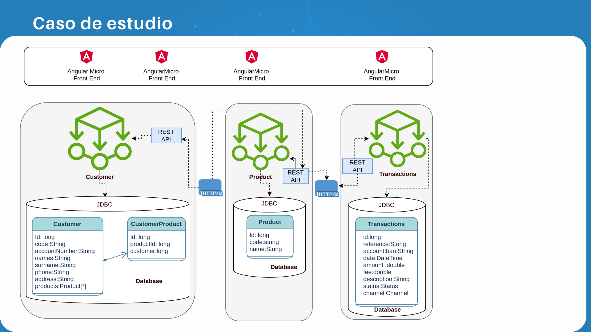

# Comunicacion

La comunicacion entre **MicroServicios** es necesaria para llevar a cabo determinada funcionaliad, como el echo de establecer relaciones entre los datos que dan forma a un negocio, sin embargo la interacion entre ellos debe quedar delimitada unicamente por peticiones **HTTP**.  

Es decir, la forma en como 2 **MicroServicios** se comunican debe ser por medio del consumo de **enpoints** y el envio de informacion en formato **JSON**, esto para descentralizar las depencias de **BD**, asi un **MicroServicio** puede estar utilizando una **BD** en **Mongo** y el otro en **MYSQL** por ejemplo.  

